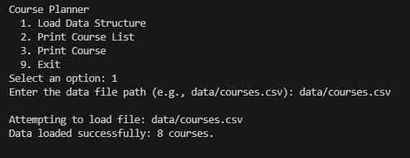
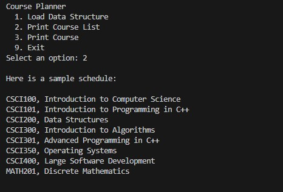

# Course Planner (CS 300 – Data Structures & Algorithms)

C++17 console application that loads course data from a CSV file, displays all courses in alphanumeric order, and supports searching a course to view its prerequisites.

This project demonstrates foundational software development skills (file I/O, parsing, OOP, data structures, and clear documentation).

---

## Tech & Concepts
- **Language:** C++17
- **Core:** OOP, modular design, debugging, file I/O, CSV parsing
- **Data Structures:** Hash Table (lookup) and Binary Search Tree (sorted traversal)
- **Build:** g++ (VS Code terminal)

---

## Demo

**Load courses from CSV**


**Print courses in alphanumeric order**


---

## Features
- Load course data from a CSV file
- Print all courses in **alphanumeric order**
- Search by course ID (example: `CS300`) to display course details and prerequisites
- Menu-driven interface

---

## Project Structure
```text
data/
  courses.csv
include/
  *.hpp
src/
  *.cpp
docs/
  demo-load.jpg
  demo-sorted.jpg
