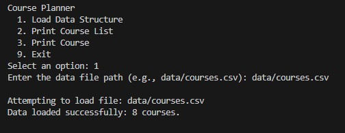
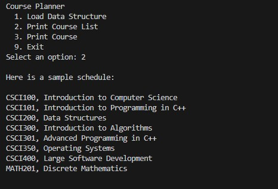

# Course Planner (CS 300 – Data Structures & Algorithms)

C++17 console application that loads course data from a CSV file, displays all courses in alphanumeric order, and supports searching a course to view its prerequisites.

This project demonstrates foundational software development skills (file I/O, parsing, OOP, data structures, and clear documentation).

---

## Tech & Concepts
- **Language:** C++17
- **Core:** OOP, modular design, debugging, file I/O, CSV parsing
- **Data Structures:** Hash Table (lookup), Binary Search Tree (sorted traversal), and Directed Graph (prerequisite relationships)
- **Build:** g++ (VS Code terminal)

---

## Demo

**Load courses from CSV**


**Print courses in alphanumeric order**


---

## Features
- Load course data from a CSV file
- Print all courses in **alphanumeric order**
- Search by course ID (example: `CS300`) to display course details and prerequisites
- Menu-driven interface

---

## Project Structure
```text
data/
  courses.csv
include/
  *.hpp
src/
  *.cpp
docs/
  demo-load.jpg
  demo-sorted.jpg

---

## CS 499 Capstone Enhancement: Algorithms and Data Structures

For the CS 499 Computer Science Capstone, this project was enhanced with a directed prerequisite graph that represents relationships between courses.

### Enhancement Features

- Builds a directed graph from course prerequisite relationships
- Uses Kahn's topological sorting algorithm to generate a prerequisite-safe course order
- Detects circular prerequisite dependencies and prevents invalid course ordering
- Preserves the original binary search tree, hash table, and course lookup functionality
- Includes a controlled cycle-test dataset in `data/courses_cycle.csv`

### Algorithm Design

Each course is represented as a vertex in the graph. A directed edge is created from a prerequisite course to the course that depends on it.

Topological sorting is performed using Kahn's algorithm. Courses with an indegree of zero are processed first, and dependent courses become available as their prerequisite edges are removed.

If every course cannot be processed, the graph contains a cycle and a valid prerequisite ordering cannot be produced.

### Time Complexity

Graph construction and topological sorting both operate in:

**O(V + E)**

where:

- `V` is the number of courses
- `E` is the number of prerequisite relationships

This approach is efficient because each vertex and prerequisite edge is processed only once during traversal.